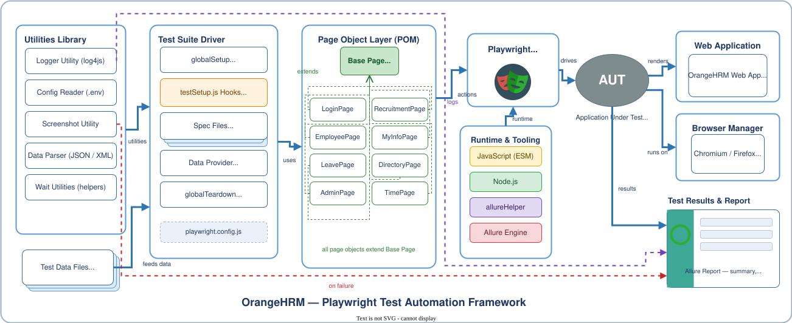

# OrangeHRM Playwright E2E — Automation CI/CD

End-to-end UI automation for the public [OrangeHRM OS Demo](https://opensource-demo.orangehrmlive.com) — Playwright + Page Object Model, Allure reporting, log4js logging, and a Jenkins CI pipeline.

| Component | Purpose |
|-----------|---------|
| **Playwright suite** | 26 tests · 8 modules · POM · Allure · log4js |
| **CI** | Jenkins (GitHub Actions workflow retained but disabled — see [CI/CD](#cicd)) |

**Target application:** `https://opensource-demo.orangehrmlive.com`  
**Default credentials:** `Admin` / `admin123`

---

## Table of contents

- [Quick start](#quick-start)
- [Prerequisites](#prerequisites)
- [Project structure](#project-structure)
- [Architecture diagram](#architecture-diagram)
- [Playwright framework](#playwright-framework)
  - [Install](#1-install-the-playwright-suite)
  - [Environment variables](#2-environment-variables)
  - [Every command to run tests](#3-every-command-to-run-tests)
  - [Allure reporting](#4-allure-reporting)
  - [Playwright HTML report](#5-playwright-html-report)
  - [Run a single test](#6-run-a-single-test)
  - [Clean generated artifacts](#7-clean-generated-artifacts)
  - [Framework layout](#8-framework-layout-course-aligned)
  - [Test modules & TC IDs](#9-test-modules--tc-ids)
  - [Hooks & fixtures](#10-hooks--fixtures)
  - [Utilities](#11-utilities)
  - [Data-driven testing rules](#12-data-driven-testing-rules)
- [CI/CD](#cicd)
- [Troubleshooting](#troubleshooting)
- [Further reading](#further-reading)

---

## Quick start

```bash
# 1 — Clone and enter the repo
cd AUTOMATION-CI-CD

# 2 — Install & run the Playwright suite (recommended stable run)
npm install
npx playwright install chromium
cp .env.example .env
npx playwright test --project=chromium --project=login-tests --project=time-serial

# 3 — Generate and open Allure report (requires Java 8+)
npm run allure:generate
npm run allure:open
```

---

## Prerequisites

| Requirement | Used for |
|-------------|----------|
| **Node.js 18+** | Playwright suite |
| **npm** | Dependency management |
| **Java 8+** | `allure generate` / `allure open` |
| **Network** | OrangeHRM demo site (public internet) |

---

## Project structure

```
AUTOMATION-CI-CD/
├── README.md                          ← you are here
├── .github/workflows/                 ← playwright.yml.disabled (legacy GH Actions CI)
├── .cursor/rules/                     ← Cursor coding rules (POM, locators, Allure)
│
├── tests/                             ← 8 spec files (26 tests)
├── pages/                             ← Page Object Model (9 classes)
├── fixtures/                          ← globalSetup, globalTeardown, testSetup
├── testdata/                          ← JSON test data (data-driven)
├── utils/                             ← config, logger, helpers, Allure, screenshots
├── assets/                            ← diagram assets
├── architecture-diagram.drawio        ← editable framework diagram
├── architecture-diagram.svg           ← rendered framework diagram
├── OrangeHRM_TC_v3.xlsx               ← test case matrix
├── playwright.config.js
└── package.json
```

---

## Architecture diagram

### Playwright test automation framework

The diagram below shows how utilities, hooks, page objects, Playwright, and Allure connect to the OrangeHRM application under test.



> **Editable source:** open [`architecture-diagram.drawio`](architecture-diagram.drawio) in [diagrams.net](https://app.diagrams.net) or the draw.io extension in VS Code/Cursor.

<details>
<summary><strong>Diagram legend (click to expand)</strong></summary>

| Arrow / element | Meaning |
|-----------------|---------|
| Solid blue arrows | Data / control flow between layers |
| Dashed green arrows | Page objects inherit from `BasePage` |
| Dashed purple arrows | Logging to file + Allure |
| Dashed red arrows | Failure screenshots attached to Allure |
| **Utilities Library** | `config.js`, `logger.js`, `dataUtil.js`, `helpers.js`, `screenshotUtil.js` |
| **Test Suite Driver** | `globalSetup` → specs → `globalTeardown` + `testSetup.js` auto-hooks |
| **Page Object Layer** | `LoginPage`, `EmployeePage`, `LeavePage`, … all extend `BasePage` |
| **Playwright Test Runner** | Browser automation engine |
| **Runtime & Tooling** | Node.js, JavaScript ESM, `allureHelper`, Allure engine |
| **AUT** | OrangeHRM demo application |

</details>

---

## Playwright framework

### 1. Install the Playwright suite

```bash
npm install
npx playwright install chromium        # required
npx playwright install firefox         # optional — used by test:all
cp .env.example .env
```

First test run triggers `fixtures/globalSetup.js`, which logs in once and writes `auth.json` for session reuse.

---

### 2. Environment variables

Create `.env` from `.env.example`:

```env
BASE_URL=https://opensource-demo.orangehrmlive.com
ADMIN_USER=Admin
ADMIN_PASS=admin123
LOG_LEVEL=info
LOG_DIR=logs
```

Read at runtime by `utils/config.js` via `dotenv`.

---

### 3. Every command to run tests

All commands below are run from the **repository root**.

#### npm scripts (recommended)

| Command | What it does |
|---------|--------------|
| `npm test` | Chromium authenticated tests + login tests |
| `npm run test:all` | Full suite — all projects (Chromium + Firefox + login + time) |
| `npm run test:ci` | Full suite with `CI=true` (2 retries, 2 workers) |
| `npm run test:login` | Login module only (`login-tests` project) |
| `npm run test:time` | Time module only (`time-serial` project — punch in/out order) |
| `npm run test:firefox` | Firefox project only |
| `npm run test:headed` | Chromium with visible browser |
| `npm run test:debug` | Chromium with Playwright Inspector |
| `npm run clean` | Delete `allure-results/`, `allure-report/`, `test-results/`, `playwright-report/` |

#### Recommended submission / stable run (26 tests)

Avoids Firefox flakiness on the shared demo:

```bash
npx playwright test --project=chromium --project=login-tests --project=time-serial
```

#### Run by module (spec file)

```bash
npx playwright test tests/login.spec.js
npx playwright test tests/employee.spec.js
npx playwright test tests/leave.spec.js
npx playwright test tests/admin.spec.js
npx playwright test tests/recruitment.spec.js
npx playwright test tests/myinfo.spec.js
npx playwright test tests/directory.spec.js
npx playwright test tests/time.spec.js
```

#### Run by Playwright project

```bash
npx playwright test --project=login-tests
npx playwright test --project=chromium
npx playwright test --project=time-serial
npx playwright test --project=firefox
```

#### Run by test case ID (grep on title)

```bash
npx playwright test --grep TC001
npx playwright test --grep TC011 --project=chromium
npx playwright test --grep "TC024" --project=time-serial
```

#### Debug & visual modes

```bash
npx playwright test --project=chromium --headed
npx playwright test --project=chromium --debug
npx playwright test tests/login.spec.js --headed --grep TC001
PWDEBUG=1 npx playwright test --project=chromium --grep TC008
```

#### List tests without running

```bash
npx playwright test --list
npx playwright test --project=chromium --list
```

#### UI mode (interactive test runner)

```bash
npx playwright test --ui
```

---

### 4. Allure reporting

Requires **Java 8+** (`java -version`).

```bash
# Run tests first (generates allure-results/)
npm run test:all
# or the stable submission run:
npx playwright test --project=chromium --project=login-tests --project=time-serial

# Generate static HTML report
npm run allure:generate

# Open report in browser
npm run allure:open

# Or serve live (no generate step)
npm run allure:serve

# One-shot: generate + open
npm run report
```

**Generated folders:**

| Folder | Contents |
|--------|----------|
| `allure-results/` | Raw JSON/XML from `allure-playwright` reporter |
| `allure-report/` | Static HTML report |
| `logs/run.log` | log4js file output |
| `logs/run-summary.txt` | Written by `globalTeardown` |

---

### 5. Playwright HTML report

```bash
npx playwright test --project=chromium
npx playwright show-report
```

Report is written to `playwright-report/` by default.

---

### 6. Run a single test

```bash
# By line number
npx playwright test tests/leave.spec.js:42

# By title grep
npx playwright test --grep "TC008" --project=chromium
```

---

### 7. Clean generated artifacts

```bash
npm run clean
rm -f auth.json                        # force fresh login on next run
```

---

### 8. Framework layout (course-aligned)

```
AUTOMATION-CI-CD/
├── tests/                 ← test scripts
├── pages/                 ← Page Object Model
├── fixtures/              ← Playwright hooks & test.extend setup
│   ├── testSetup.js       ← auto: TC-ID, screenshot, logs, error attach
│   ├── globalSetup.js     ← one-time login → auth.json
│   └── globalTeardown.js  ← run summary + log4js shutdown
├── testdata/              ← JSON data-driven test data
├── utils/                 ← shared utilities
├── logs/                  ← generated at runtime
├── allure-results/        ← generated at runtime
└── allure-report/         ← generated at runtime
```

**Important:** specs import `{ test, expect }` from `fixtures/testSetup.js`, **not** directly from `@playwright/test`.

---

### 9. Test modules & TC IDs

| Module | Spec | Page object | Tests | Playwright project |
|--------|------|-------------|-------|-------------------|
| Login | `login.spec.js` | `LoginPage` | TC001–TC004 (incl. logout) | `login-tests` |
| PIM / Employee | `employee.spec.js` | `EmployeePage` | TC004–TC007 | `chromium` |
| Leave | `leave.spec.js` | `LeavePage` | TC008–TC011 | `chromium` |
| Admin / Users | `admin.spec.js` | `AdminPage` | TC012–TC014 | `chromium` |
| Recruitment | `recruitment.spec.js` | `RecruitmentPage` | TC015–TC017 | `chromium` |
| My Info | `myinfo.spec.js` | `MyInfoPage` | TC018–TC020 | `chromium` |
| Directory | `directory.spec.js` | `DirectoryPage` | TC021–TC022 | `chromium` |
| Time | `time.spec.js` | `TimePage` | TC023–TC025 | `time-serial` |

**Total: 26 automated tests** across 8 modules.

Full step-by-step definitions: [`OrangeHRM_TC_v3.xlsx`](OrangeHRM_TC_v3.xlsx)

---

### 10. Hooks & fixtures

| Hook | File | When it runs | What it does |
|------|------|--------------|--------------|
| `globalSetup` | `fixtures/globalSetup.js` | Once before all tests | Admin login → `auth.json` |
| `globalTeardown` | `fixtures/globalTeardown.js` | Once after all tests | Run summary, API cleanup, log4js shutdown |
| `testSetup` (auto fixture) | `fixtures/testSetup.js` | Every test | TC-ID annotation, screenshot, error attach, log attach |

---

### 11. Utilities

| Utility | File | Purpose |
|---------|------|---------|
| Config reader | `utils/config.js` | `BASE_URL`, credentials from `.env` |
| Data util | `utils/dataUtil.js` | `loadTestData()` — JSON from `testdata/` |
| Logger | `utils/logger.js` | log4js → console + `logs/run.log` + Allure attach |
| Form helpers | `utils/helpers.js` | `setInput`, `pickAutocomplete`, `pickSelect`, dates |
| Screenshot util | `utils/screenshotUtil.js` | Pass/fail screenshots in Allure |
| Allure helper | `utils/allureHelper.js` | Suite/feature/story labels, error attachments |

**Key helpers (never hardcode in specs):**

```js
getTimestamp()
getFutureWorkingDate()
discoverEmployee(page)
setInput(page, label, value)
pickAutocomplete(page, label, value)
```

---

### 12. Data-driven testing rules

- All static test data lives in **`testdata/*.json`** — not in spec files.
- Load with `loadTestData('employees')` from `utils/dataUtil.js`.
- Dynamic values use helpers — never hardcode employee names or dates.
- Date format on the demo: `yyyy-dd-mm` via `formatDateForInput` / `getFutureDate`.
- Leave type: prefer `CAN - Vacation` from `testdata/leave.json`.
- Never use `page.waitForTimeout()` — use `expect`, `waitFor`, or `expect.poll`.

---

## CI/CD

**CI runs on Jenkins.** The previous GitHub Actions pipeline is kept for reference at
[`.github/workflows/playwright.yml.disabled`](.github/workflows/playwright.yml.disabled) and
does **not** run — GitHub only picks up `*.yml` / `*.yaml` inside `.github/workflows/`.

```bash
# to re-enable GitHub Actions
mv .github/workflows/playwright.yml.disabled .github/workflows/playwright.yml
```

The pipeline steps a CI job needs to reproduce:

```
checkout → npm ci → cp .env.example .env
        → npx playwright install chromium --with-deps
        → npm run test:ci          (CI=true → 1 retry, 1 worker)
        → archive playwright-report/ and allure-results/
```

> ⚠️ `npm run test:ci` currently runs only `--project=chromium --project=login-tests`,
> so **TC023–TC025 (Time) are not covered in CI**. Add `--project=time-serial` if you want them.

Run locally the same way CI does:

```bash
npm ci
npx playwright install --with-deps
CI=true npx playwright test
```

---

## Troubleshooting

<details>
<summary><strong>Playwright issues</strong></summary>

| Problem | Fix |
|---------|-----|
| `auth.json` missing | Delete it and re-run any test — `globalSetup` regenerates it |
| Session expired mid-run | `BasePage.navigate()` re-logs in automatically |
| `No Working Days Selected` (leave) | Use `getFutureWorkingDate()` — never hardcode dates |
| Firefox tests flaky | Use `--project=chromium --project=login-tests --project=time-serial` |
| Vue inputs not filling | Use `setInput` / `pickAutocomplete` from `helpers.js` — not raw `fill()` |
| Allure `generate` fails | Install Java 8+: `sudo apt install default-jre` |

</details>

<details>
<summary><strong>Architecture diagram logo not showing</strong></summary>

If the Playwright logo is blank in the draw.io editor:

1. Close the diagram tab **without saving**
2. Reopen `architecture-diagram.drawio`
3. When prompted "File changed on disk" → choose **Revert / Reload**

The logo is embedded as a transparent PNG inside the draw.io XML.

</details>

---

## Further reading

| Document | Location |
|----------|----------|
| Test case matrix | [`OrangeHRM_TC_v3.xlsx`](OrangeHRM_TC_v3.xlsx) |
| Editable framework diagram | [`architecture-diagram.drawio`](architecture-diagram.drawio) |
| Legacy CI pipeline (disabled) | [`.github/workflows/playwright.yml.disabled`](.github/workflows/playwright.yml.disabled) |

---

**License:** Educational / coursework project.  
**Demo app:** [OrangeHRM Open Source Demo](https://opensource-demo.orangehrmlive.com) — public sandbox, data resets periodically.
